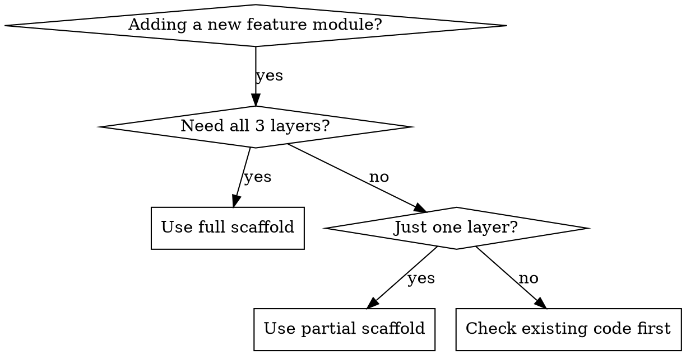

# SchoolBuzzMate Scaffold Generator

## Overview

Generate complete, type-safe modules for SchoolBuzzMate following project conventions. Every new feature needs three layers: **Page** (Vue3+TS), **API** (service abstraction), and **Cloud Function** (backend logic). This skill ensures all three are created consistently.

## When to Use



**Use when:**
- Creating a new page (e.g., "add a product detail page")
- Adding a new cloud function action (e.g., "add search to product-co")
- Creating a new API service module
- Setting up a new database collection
- Need a complete feature module (page + API + cloud function + types)

## Project Conventions

### Naming

| Element | Convention | Example |
|---------|-----------|---------|
| Page file | kebab-case.vue | `product-detail.vue` |
| API file | kebab-case.ts | `product.ts` |
| Cloud function | kebab-case-co | `product-co` |
| Cloud function action | camelCase | `getList`, `getDetail` |
| TypeScript interface | PascalCase | `Product`, `ProductListParams` |
| Database collection | snake_case | `products` |
| Pinia store | camelCase.ts | `user.ts`, `school.ts` |

### Directory Locations

```
src/pages/{module}/          # Pages
src/api/{module}.ts          # API service layer
src/types/{module}.ts        # TypeScript types
src/stores/{module}.ts       # Pinia stores (if needed)
uniCloud-aliyun/cloudfunctions/{module}-co/  # Cloud function
```

## Full Scaffold Template

### Step 1: TypeScript Types

```typescript
// src/types/{module}.ts
// Define all interfaces, enums, and type aliases for the module

/** {Entity} status enum */
export enum {Entity}Status {
  /** Inactive */
  INACTIVE = 0,
  /** Active */
  ACTIVE = 1,
}

/** {Entity} entity */
export interface {Entity} {
  _id: string
  // Core fields
  title: string
  status: {Entity}Status
  createDate: string
  updateDate: string
}

/** List query params */
export interface {Entity}ListParams {
  page: number
  size: number
  keyword?: string
  sort?: 'newest' | 'popular'
}

/** List response */
export interface {Entity}ListResult {
  list: {Entity}[]
  total: number
}

/** Create params */
export interface Create{Entity}Params {
  title: string
  // ... other required fields
}
```

### Step 2: API Service Layer

```typescript
// src/api/{module}.ts

import type { {Entity}, {Entity}ListParams, {Entity}ListResult, Create{Entity}Params } from '@/types/{module}'
import type { ApiResponse } from '@/types/api'

// MVP: UniCloud implementation
const API_MODE: 'unicloud' | 'springboot' = 'unicloud'

const CLOUD_FUNCTION = '{module}-co'

/**
 * Get paginated list
 */
export async function get{Entity}List(params: {Entity}ListParams): Promise<{Entity}ListResult> {
  if (API_MODE === 'unicloud') {
    const res = await uniCloud.callFunction({
      name: CLOUD_FUNCTION,
      data: { action: 'getList', params }
    })
    const body = res.result as ApiResponse<{Entity}ListResult>
    if (body.code !== 0) throw new Error(body.msg)
    return body.data
  }
  // Spring Boot: return http.get('/{module}-api/{entity}/list', params)
  throw new Error('Spring Boot mode not implemented yet')
}

/**
 * Get detail by ID
 */
export async function get{Entity}Detail(id: string): Promise<{Entity}> {
  if (API_MODE === 'unicloud') {
    const res = await uniCloud.callFunction({
      name: CLOUD_FUNCTION,
      data: { action: 'getDetail', params: { id } }
    })
    const body = res.result as ApiResponse<{Entity}>
    if (body.code !== 0) throw new Error(body.msg)
    return body.data
  }
  throw new Error('Spring Boot mode not implemented yet')
}

/**
 * Create new entity
 */
export async function create{Entity}(data: Create{Entity}Params): Promise<{Entity}> {
  if (API_MODE === 'unicloud') {
    const res = await uniCloud.callFunction({
      name: CLOUD_FUNCTION,
      data: { action: 'create', params: data }
    })
    const body = res.result as ApiResponse<{Entity}>
    if (body.code !== 0) throw new Error(body.msg)
    return body.data
  }
  throw new Error('Spring Boot mode not implemented yet')
}

/**
 * Update entity
 */
export async function update{Entity}(id: string, data: Partial<Create{Entity}Params>): Promise<void> {
  if (API_MODE === 'unicloud') {
    const res = await uniCloud.callFunction({
      name: CLOUD_FUNCTION,
      data: { action: 'update', params: { id, ...data } }
    })
    const body = res.result as ApiResponse
    if (body.code !== 0) throw new Error(body.msg)
    return
  }
  throw new Error('Spring Boot mode not implemented yet')
}

/**
 * Delete entity (soft delete)
 */
export async function delete{Entity}(id: string): Promise<void> {
  if (API_MODE === 'unicloud') {
    const res = await uniCloud.callFunction({
      name: CLOUD_FUNCTION,
      data: { action: 'delete', params: { id } }
    })
    const body = res.result as ApiResponse
    if (body.code !== 0) throw new Error(body.msg)
    return
  }
  throw new Error('Spring Boot mode not implemented yet')
}
```

### Step 3: Cloud Function

```javascript
// uniCloud-aliyun/cloudfunctions/{module}-co/index.js
'use strict'

const db = uniCloud.database()

const ACTIONS = {
  getList: require('./actions/getList'),
  getDetail: require('./actions/getDetail'),
  create: require('./actions/create'),
  update: require('./actions/update'),
  delete: require('./actions/delete'),
}

exports.main = async (event, context) => {
  const { action, params = {} } = event

  if (!ACTIONS[action]) {
    return { code: -1, msg: `Unknown action: ${action}` }
  }

  try {
    const result = await ACTIONS[action](params, context)
    return { code: 0, msg: 'success', data: result }
  } catch (error) {
    console.error(`[{module}-co.${action}]`, error)
    return {
      code: -1,
      msg: error.message || 'Operation failed'
    }
  }
}
```

```javascript
// uniCloud-aliyun/cloudfunctions/{module}-co/actions/getList.js
const db = uniCloud.database()

module.exports = async function getList(params, context) {
  const { page = 1, size = 10, keyword } = params

  const where = { status: 1 }
  if (keyword) {
    where.title = new RegExp(keyword, 'i')
  }

  const [list, countResult] = await Promise.all([
    db.collection('{collection_name}')
      .where(where)
      .orderBy('create_date', 'desc')
      .skip((page - 1) * size)
      .limit(size)
      .get(),
    db.collection('{collection_name}').where(where).count()
  ])

  return { list: list.data, total: countResult.total }
}
```

```javascript
// uniCloud-aliyun/cloudfunctions/{module}-co/actions/create.js
const db = uniCloud.database()

module.exports = async function create(params, context) {
  const userId = context.UNIID_USER?._id
  if (!userId) throw new Error('Please login first')

  const doc = {
    ...params,
    seller_id: userId,
    status: 1,
    create_date: new Date(),
    update_date: new Date(),
  }

  const result = await db.collection('{collection_name}').add(doc)
  return { _id: result.id, ...doc }
}
```

```javascript
// uniCloud-aliyun/cloudfunctions/{module}-co/package.json
{
  "name": "{module}-co",
  "version": "1.0.0",
  "description": "{Module} cloud function for SchoolBuzzMate",
  "main": "index.js"
}
```

### Step 4: Vue3 Page

```vue
<!-- src/pages/{module}/list.vue -->
<script setup lang="ts">
import { ref, onMounted } from 'vue'
import { onReachBottom, onPullDownRefresh } from '@dcloudio/uni-app'
import { get{Entity}List } from '@/api/{module}'
import type { {Entity}, {Entity}ListParams } from '@/types/{module}'

// === State ===
const list = ref<{Entity}[]>([])
const page = ref(1)
const loading = ref(false)
const hasMore = ref(true)
const keyword = ref('')

// === Computed ===
const isEmpty = computed(() => !loading.value && list.value.length === 0)

// === Methods ===
async function loadData(isRefresh = false) {
  if (loading.value) return
  if (!isRefresh && !hasMore.value) return

  loading.value = true
  if (isRefresh) page.value = 1

  try {
    const params: {Entity}ListParams = {
      page: page.value,
      size: 10,
      keyword: keyword.value || undefined,
    }

    const result = await get{Entity}List(params)

    if (isRefresh) {
      list.value = result.list
    } else {
      list.value.push(...result.list)
    }

    hasMore.value = result.list.length === 10
    page.value++
  } catch (error) {
    uni.showToast({ title: '加载失败', icon: 'none' })
    console.error('[{Module}List]', error)
  } finally {
    loading.value = false
  }
}

function onSearch() {
  loadData(true)
}

// === Lifecycle ===
onMounted(() => loadData(true))

// === Pull to refresh / Load more ===
onPullDownRefresh(async () => {
  await loadData(true)
  uni.stopPullDownRefresh()
})

onReachBottom(() => loadData())
</script>

<template>
  <view class="page">
    <!-- Search -->
    <view class="search-bar">
      <wd-search v-model="keyword" placeholder="搜索..." @search="onSearch" />
    </view>

    <!-- List -->
    <view v-if="!isEmpty" class="list">
      <view
        v-for="item in list"
        :key="item._id"
        class="card"
        @click="handleItemClick(item)"
      >
        <text class="card-title">{{ item.title }}</text>
      </view>
    </view>

    <!-- Empty -->
    <wd-status-tip v-else image="content" tip="暂无数据" />

    <!-- Load more -->
    <view v-if="hasMore && !isEmpty" class="load-more">
      <wd-loading v-if="loading" />
      <text v-else class="hint">上拉加载更多</text>
    </view>
  </view>
</template>

<style scoped>
.page {
  min-height: 100vh;
  background: var(--bg-color, #f5f5f5);
}

.search-bar {
  padding: 20rpx;
  background: #fff;
}

.list {
  padding: 20rpx;
}

.card {
  background: #fff;
  border-radius: 16rpx;
  padding: 24rpx;
  margin-bottom: 20rpx;
}

.card-title {
  font-size: 28rpx;
  font-weight: 500;
  color: #333;
}

.load-more {
  padding: 30rpx;
  text-align: center;
}

.hint {
  color: #999;
  font-size: 24rpx;
}
</style>
```

## Common Mistakes

| Mistake | Fix |
|---------|-----|
| Forgot to register page in `pages.json` | Add entry to `pages.json` → `pages` array |
| Cloud function action not in route table | Add to `ACTIONS` object in `index.js` |
| TypeScript types not imported | Import from `@/types/{module}` |
| Mixed camelCase/snake_case | Use camelCase in TS, snake_case in DB |
| API function signature changes between modes | Keep UniCloud and Spring Boot signatures identical |
| Database collection not created | Create in UniCloud Web Console before testing |

## Module Checklist

After scaffolding a new module, verify:

- [ ] `src/types/{module}.ts` — All interfaces defined
- [ ] `src/api/{module}.ts` — All API methods with both UniCloud and Spring Boot stubs
- [ ] `uniCloud-aliyun/cloudfunctions/{module}-co/index.js` — Route dispatch
- [ ] `uniCloud-aliyun/cloudfunctions/{module}-co/actions/` — At least getList, getDetail, create, update, delete
- [ ] `uniCloud-aliyun/cloudfunctions/{module}-co/package.json` — Dependencies declared
- [ ] `src/pages/{module}/list.vue` — List page with pull-to-refresh and load-more
- [ ] `src/pages.json` — Page registered in navigation
- [ ] Database collection created in UniCloud Web Console
- [ ] Cloud function uploaded and tested