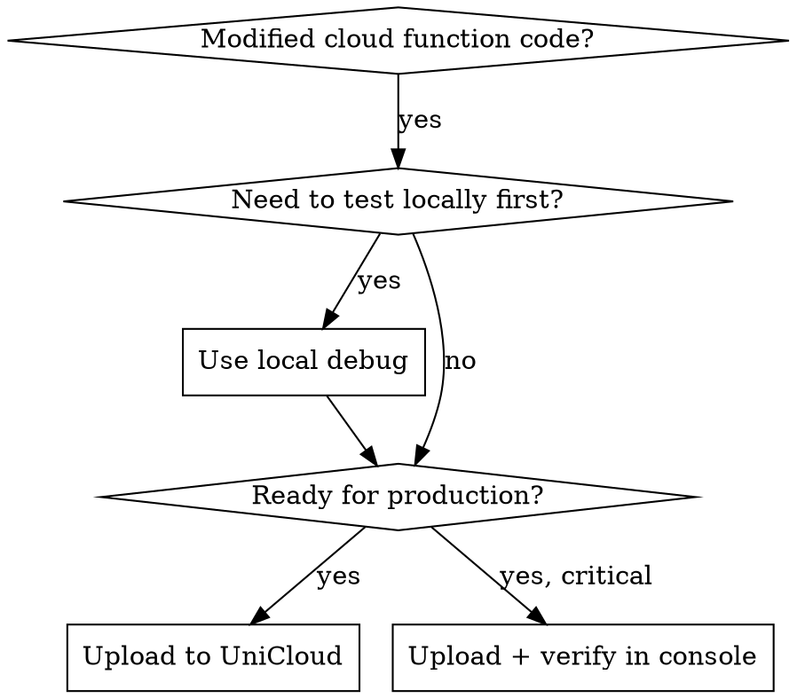

# UniCloud Deploy

## Overview

Deploy and debug UniCloud cloud functions for SchoolBuzzMate. Covers the complete cloud function lifecycle: local debugging → upload → test → production deploy.

## When to Use



**Use when:**
- Created or modified a cloud function in `uniCloud-aliyun/cloudfunctions/`
- Need to test a cloud function before deploying
- Cloud function returns errors in production
- Setting up uni-id or uni-pay for the first time
- Database schema changes need to be uploaded

**Do NOT use for:**
- Frontend-only changes (use wechat-dev-cycle)
- Database data manipulation (use UniCloud Web Console)
- Initial UniCloud space setup (one-time, see setup below)

## Quick Reference

| Action | How |
|--------|-----|
| Local debug | HBuilderX → 运行 → 连接本地云函数 |
| Upload single function | HBuilderX → 右键云函数 → 上传 |
| Upload all functions | HBuilderX → 右键 uniCloud-aliyun → 上传所有云函数 |
| View logs | UniCloud Web Console → 云函数 → 日志 |
| Test in browser | UniCloud Web Console → 云函数 → 测试 |
| Upload DB schema | HBuilderX → 右键 database → 上传 |

## Project Cloud Functions

```
uniCloud-aliyun/cloudfunctions/
├─ uni-id-co/          # uni-id auth (official, rarely modified)
├─ uni-pay-co/         # uni-pay payments (official, rarely modified)
├─ product-co/         # Product CRUD + search
├─ order-co/           # Order lifecycle
├─ payment-co/         # Payment processing
├─ social-co/          # Comments, favorites, messages, follows
├─ marketing-co/       # Coupons, points, group buying
├─ school-co/          # School verification, stats
└─ admin-co/           # Dashboard, auditing, reports
```

## Cloud Function Standard Structure

Every SchoolBuzzMate cloud function follows this pattern:

```
function-name/
├─ index.js            # Entry + route dispatch
├─ package.json        # Dependencies (if any)
├─ actions/            # Business logic (one file per action)
│  ├─ getList.js
│  ├─ getDetail.js
│  ├─ create.js
│  ├─ update.js
│  └─ delete.js
└─ common/             # Shared utilities
   ├─ validator.js     # Joi validation schemas
   └─ errors.js        # Error codes
```

## Core Workflows

### Workflow 1: Local Debugging (Fastest)

Best for rapid iteration — no deploy needed:

```
1. Open HBuilderX with the project
2. In the top-right console panel, switch to "连接本地云函数"
3. Run the mini program (pnpm run dev:mp-weixin)
4. All uniCloud.callFunction() calls go to local cloud functions
5. Set breakpoints in HBuilderX → Run → Debug
```

### Workflow 2: Deploy Single Cloud Function

After modifying one cloud function:

```
1. In HBuilderX, expand uniCloud-aliyun/cloudfunctions/
2. Right-click the modified cloud function folder
3. Select "上传部署" (Upload and Deploy)
4. Wait for "上传成功" (Upload Success) message
5. Test in the mini program
```

### Workflow 3: Deploy All Cloud Functions

After major changes or before release:

```
1. In HBuilderX, right-click uniCloud-aliyun/ folder
2. Select "上传所有云函数" (Upload All Cloud Functions)
3. Wait for completion
4. Verify in UniCloud Web Console → Cloud Functions
```

### Workflow 4: Database Schema Changes

When adding/changing MongoDB collections:

```
1. Edit uniCloud-aliyun/database/*.schema.json files
2. Right-click database/ folder → "上传DB Schema"
3. Or: create collection directly in UniCloud Web Console
4. Verify indexes are created correctly
```

### Workflow 5: Debug Production Errors

```
1. Go to UniCloud Web Console (https://unicloud.dcloud.net.cn)
2. Select your service space
3. Cloud Functions → select the function → Logs tab
4. Filter by time range to find error logs
5. Reproduce the issue with test parameters
6. Fix locally, test, then upload
```

## Common Mistakes

| Mistake | Fix |
|---------|-----|
| Can't find cloud function in HBuilderX | Check that `uniCloud-aliyun/` exists at project root and is associated with a service space |
| Cloud function returns "unknown action" | Verify the action name matches the route table in `index.js` |
| uni-id authentication fails | Check `uni-config-center/uni-id/config.json` is uploaded |
| Changes not taking effect | Upload the cloud function again — local cache might be stale |
| Forgot to upload dependencies | If `package.json` changed, upload again with dependencies |
| Wrong service space | Right-click uniCloud-aliyun → "关联服务空间" to verify |

## Testing Cloud Functions

Use UniCloud Web Console for quick testing:

```
1. Open https://unicloud.dcloud.net.cn
2. Cloud Functions → product-co → Test
3. Enter test parameters:
   {
     "action": "getList",
     "params": {
       "page": 1,
       "size": 10,
       "schoolId": "test_school_id"
     }
   }
4. Check response for expected data
```

## uni-id Configuration

The uni-id config is in `uniCloud-aliyun/cloudfunctions/common/uni-config-center/uni-id/config.json`:

```json
{
  "passwordSecret": "your-secret",
  "tokenSecret": "your-token-secret",
  "tokenExpiresIn": 2592000,
  "mp-weixin": {
    "oauth": {
      "weixin": {
        "appid": "your-miniprogram-appid",
        "appsecret": "your-miniprogram-appsecret"
      }
    }
  }
}
```

**After modifying uni-id config, re-upload the uni-id-co cloud function.**

## When Cloud Functions Are Not the Answer

- **Simple data queries** → Use clientDB directly (uniCloud.database())
- **Static config** → Use `uni-config-center` instead of hardcoding
- **Scheduled tasks** → Use UniCloud scheduled triggers
- **File processing** → Use UniCloud file storage + cloud function triggers