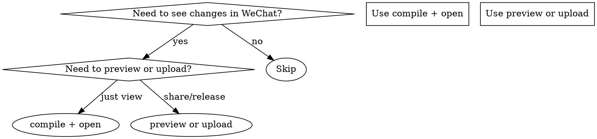

# WeChat Dev Cycle

## Overview

One-command automation for the SchoolBuzzMate WeChat mini program development cycle. Wraps HBuilderX CLI, npm/pnpm, and WeChat DevTools CLI into a single workflow.

## When to Use



**Use when:**
- After editing `.vue`/`.ts`/`.scss` files and want to see the result in the simulator
- Need to generate a preview QR code for testing on a real device
- Ready to upload a new version to WeChat
- Setting up the dev environment for the first time
- The dev cycle of "edit → compile → check" feels slow

**Do NOT use for:**
- H5 development (use `pnpm run dev:h5` directly)
- UniCloud cloud function changes only (use unicloud-deploy skill)

## Quick Reference

| Action | Command |
|--------|---------|
| Compile + open DevTools | `pnpm run dev:mp-weixin` then open DevTools |
| Preview on phone | `pnpm run build:mp-weixin` + `cli preview` |
| Upload release | `pnpm run build:mp-weixin` + `cli upload` |
| Check login | `cli islogin` |
| Build npm in DevTools | `cli build-npm --project <path>` |

## Tool Paths

```powershell
$WX_CLI = "E:\Tencent微信web开发者工具\微信web开发者工具\cli.bat"
$HBX = "E:\HbuilderX\HBuilderX\HBuilderX.exe"
$HBX_CLI = "E:\HbuilderX\HBuilderX\cli.exe"
```

## Core Workflows

### Workflow 1: Edit → Compile → View (most common)

After editing code, the fastest way to see changes:

```powershell
# Step 1: Compile to WeChat mini program (from project root)
pnpm run dev:mp-weixin

# Step 2: Open WeChat DevTools (in parallel terminal)
& "E:\Tencent微信web开发者工具\微信web开发者工具\cli.bat" open --project ".\dist\dev\mp-weixin"
```

The `dev:mp-weixin` command watches for changes and auto-recompiles. The DevTools auto-refresh when files change. **Once both are running, just edit and save — no manual steps needed.**

### Workflow 2: Preview on Real Device

```powershell
# Step 1: Build production
pnpm run build:mp-weixin

# Step 2: Generate preview QR code
& "E:\Tencent微信web开发者工具\微信web开发者工具\cli.bat" preview --project ".\dist\build\mp-weixin" --qr-format terminal

# Step 3: Scan QR code with WeChat on phone
```

### Workflow 3: Upload for Release

```powershell
# Step 1: Build production
pnpm run build:mp-weixin

# Step 2: Check login status
& "E:\Tencent微信web开发者工具\微信web开发者工具\cli.bat" islogin

# Step 3: Upload (if logged in)
& "E:\Tencent微信web开发者工具\微信web开发者工具\cli.bat" upload --project ".\dist\build\mp-weixin" -v "1.0.0" -d "版本描述"
```

### Workflow 4: First-Time Setup

```powershell
# 1. Ensure WeChat DevTools service port is enabled
#    Open DevTools → Settings → Security → Enable Service Port

# 2. Install dependencies
pnpm install

# 3. Compile
pnpm run dev:mp-weixin

# 4. Open DevTools
& "E:\Tencent微信web开发者工具\微信web开发者工具\cli.bat" open --project ".\dist\dev\mp-weixin"

# 5. Login (first time only)
& "E:\Tencent微信web开发者工具\微信web开发者工具\cli.bat" login
```

## Common Mistakes

| Mistake | Fix |
|---------|-----|
| DevTools won't open | Enable "Service Port" in DevTools Settings → Security |
| `cli` command not found | Use full path: `E:\Tencent微信web开发者工具\微信web开发者工具\cli.bat` |
| Login expired | Run `cli login` and scan QR code |
| Compile errors in DevTools | Run `cli build-npm --project ".\dist\dev\mp-weixin"` to rebuild npm packages |
| `project.config.json` missing | Ensure `dist/dev/mp-weixin` exists after compile |
| Preview shows old version | Run `pnpm run build:mp-weixin` (not dev) for previews |

## Automation Script

For a full one-click dev launch, use `scripts/dev.ps1` from the project root:

```powershell
# scripts/dev.ps1 — One-click dev environment
param(
  [ValidateSet("h5", "mp-weixin")]
  [string]$Platform = "mp-weixin"
)

$ProjectRoot = Split-Path -Parent $PSScriptRoot
$WX_CLI = "E:\Tencent微信web开发者工具\微信web开发者工具\cli.bat"
$WX_PROJECT = "$ProjectRoot\dist\dev\mp-weixin"

Write-Host "Compiling to $Platform..." -ForegroundColor Cyan
Push-Location $ProjectRoot
pnpm run "dev:$Platform" &
Start-Sleep -Seconds 5

if ($Platform -eq "mp-weixin" -and (Test-Path $WX_PROJECT)) {
    Write-Host "Opening WeChat DevTools..." -ForegroundColor Cyan
    & $WX_CLI open --project $WX_PROJECT
}

Write-Host "Dev environment ready. Edit files and changes auto-reload." -ForegroundColor Green
```

## WeChat DevTools HTTP API (Fallback)

When CLI doesn't work, use HTTP API. Port is stored in `$env:LOCALAPPDATA\微信开发者工具\User Data\Default\.ide`:

```powershell
$Port = Get-Content "$env:LOCALAPPDATA\微信开发者工具\User Data\Default\.ide"
$Base = "http://localhost:$Port/v2"
Invoke-RestMethod "$Base/islogin"
Invoke-RestMethod "$Base/preview?project=$encodedProjectPath"
```